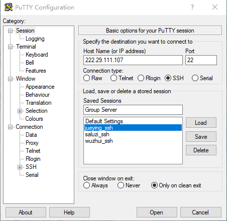
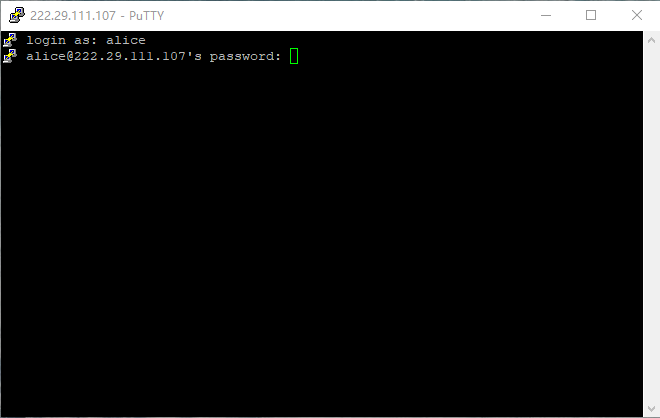
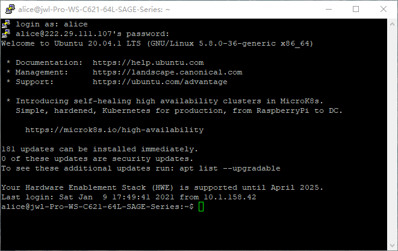
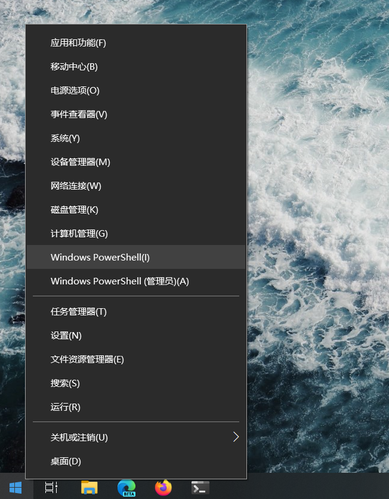
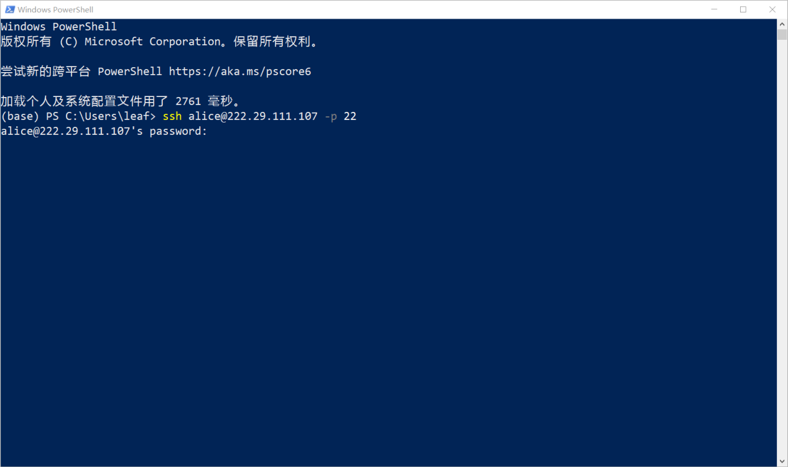
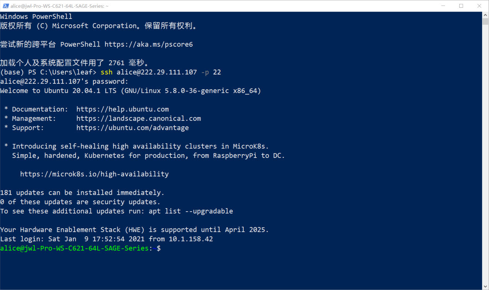

# 服务器使用说明

## 连接到服务器

### SSH

使用ssh可以连接到命令行界面。常用的工具有PuTTy, MobaXterm等。使用cmd或者Powershell等命令行工具也可以连接，但是需要单独安装ssh。以下介绍如何使用PuTTy以及win10自带的PowerShell连接服务器。

1. 使用PuTTY连接

   1. 安装PuTTY：https://www.chiark.greenend.org.uk/~sgtatham/putty/

   2. 打开PuTTY，选中Category最上方的Session并配置服务器信息。内容包括服务器地址、端口。建议将配置保存在一个特定的名称下。这里我设置的是Group Server。

      

      Saved Sessions中的其它ssh配置是我登录过的其它服务器，不要在意:)

   3. 输入用户名及密码，此处以alice为例

      

      

      即可登录到服务器，效果大致如图所示

      

   

2. 使用PowerShell连接

   1. 安装并启用win10自带的OpenSSH：https://jingyan.baidu.com/article/624e7459f0783274e8ba5aa3.html

   2. 右键开始菜单图标，点击Windows PowerShell

      

   3. 输入命令```ssh alice@222.29.111.107 -p 22```，将alice替换为你的用户名。然后输入密码

      
      
      登录成功后效果大致如图所示
      
      
      
