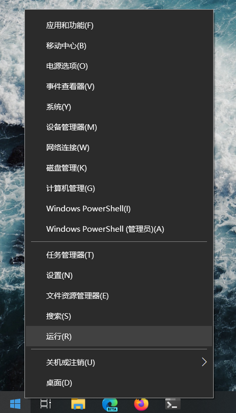
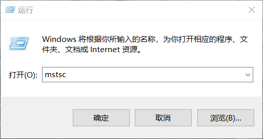
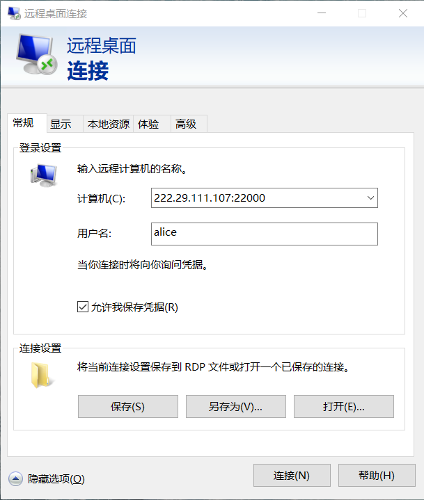
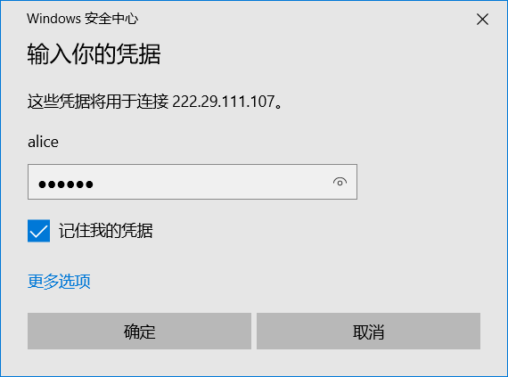
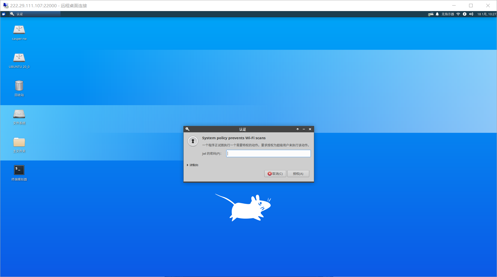

# RDP

使用RDP可以连接到图形用户界面。在Windows上可以使用系统自带的远程桌面连接。

1. 右键开始菜单，点击`运行`。

   

2. 在弹出的窗口中输入`mstsc`并回车。

   

3. 在弹出窗口中输入服务器、端口、用户名并点击`允许我保存凭据`，然后点击连接。

   

4. 在弹出窗口中输入密码，勾选`记住我的凭据`并点击确定。

   

5. 如果弹出如下提示窗口，直接点击`是`进行连接即可。

   

6. 成功连接后效果大致如图所示。如果显示图中对话框，直接点击取消。

   

[返回主页](https://zhangqian-sh.github.io/Group-Server-Tutorial)
