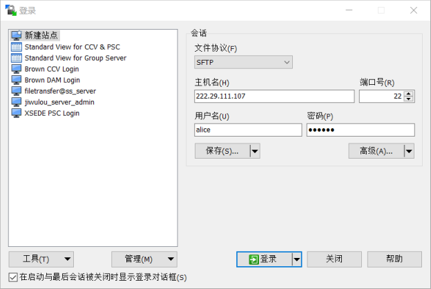
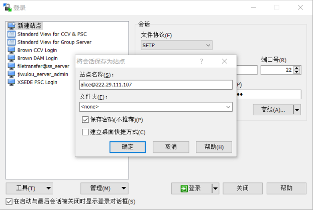
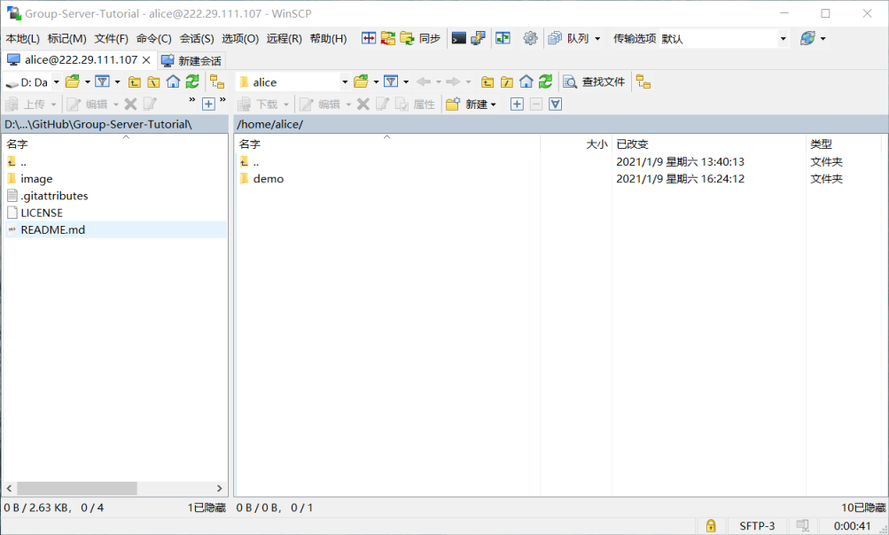
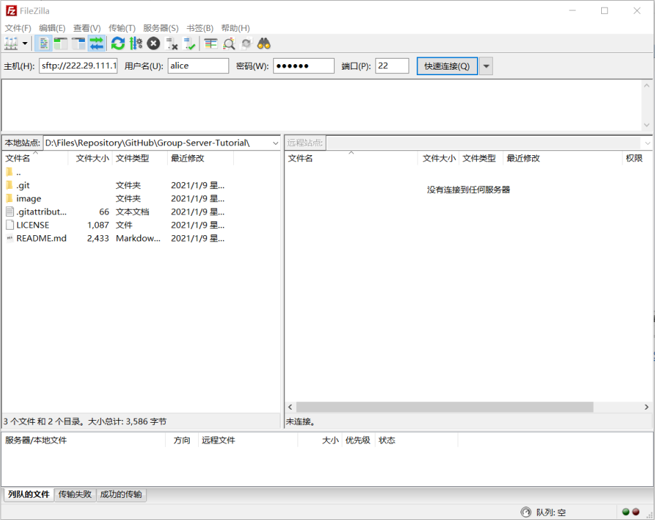

# SFTP

使用SFTP命令可以连接到服务器的文件系统，方便传输文件。常用的工具有WinSCP, FileZilla等。WinSCP适合用于较小较少文件的日常管理，FileZilla可能更适合少量大文件的传输。

1. 使用WinSCP

   1. 下载WinSCP：https://winscp.net/eng/index.php

   2. 打开WinSCP并配置服务器信息。内容包括协议、主机名、端口、用户名、密码。然后点击登录。

      

   3. 建议：在登录前点击保存，保存用户名及密码，方便日常连接使用。

      

   4. 成功连接后的效果

      

      可以通过复制粘贴、拖拽等方式上传下载文件。具体使用方法可以参见官方文档：https://winscp.net/eng/docs/start

2. 使用FileZilla

   1. 安装FileZilla Client：https://filezilla-project.org/

   2. 打开FileZilla并配置服务器信息，内容包括协议+主机名、用户名、密码、端口，并点击快速连接。连接成功后，以后如需再次连接，只需要点击快速连接右侧的向下箭头，就会有连接的历史记录。

      

   3. 成功连接后的效果。FileZilla的使用方法和WinSCP类似。

      

      注：WinSCP及FileZilla连接成功后远程目录内容看似不同，这是因为“.”开头的文件及文件夹在Linux系统下是隐藏的，WinSCP选择不显示而FileZilla选择显示。

[返回主页](https://zhangqian-sh.github.io/Group-Server-Tutorial)
