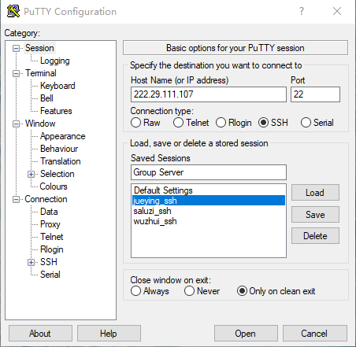
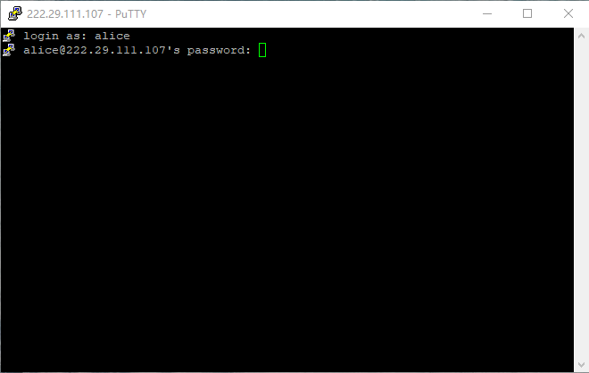
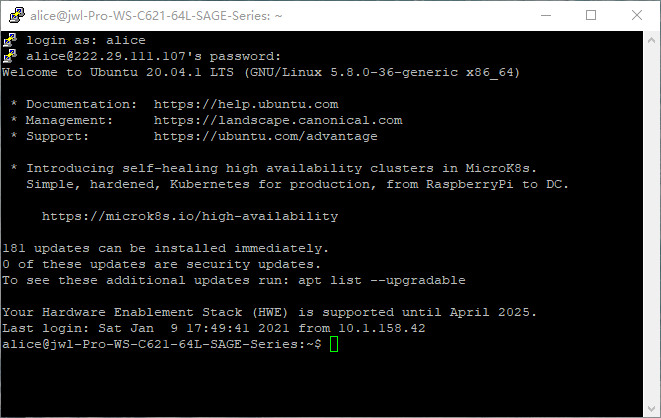
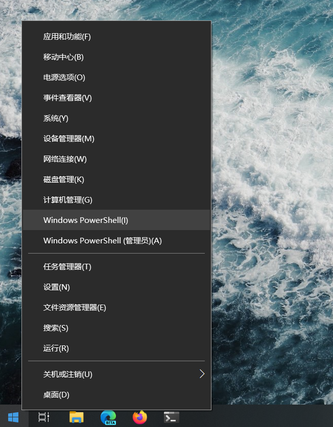
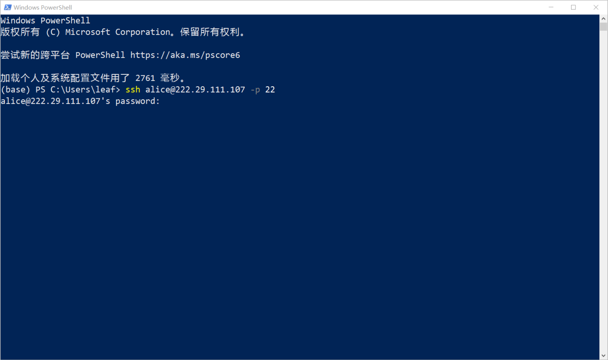
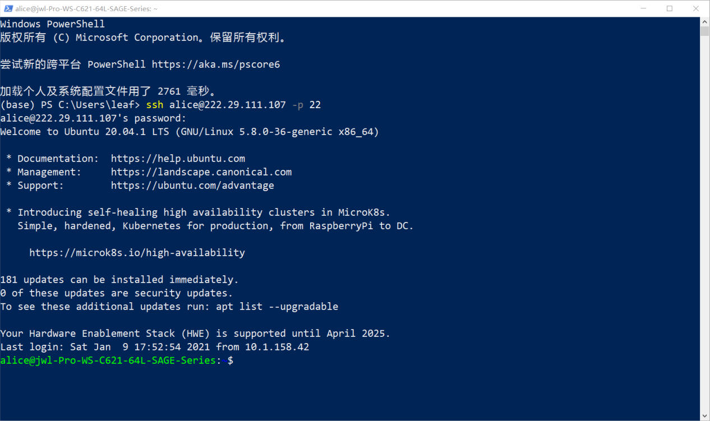
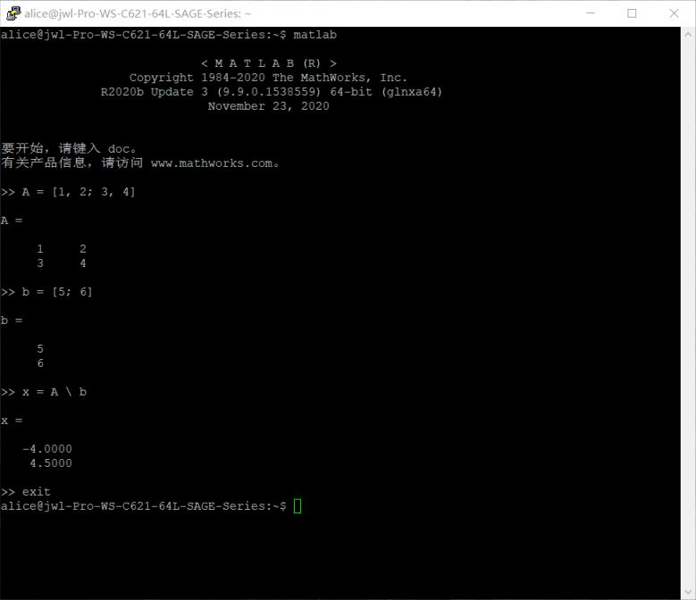
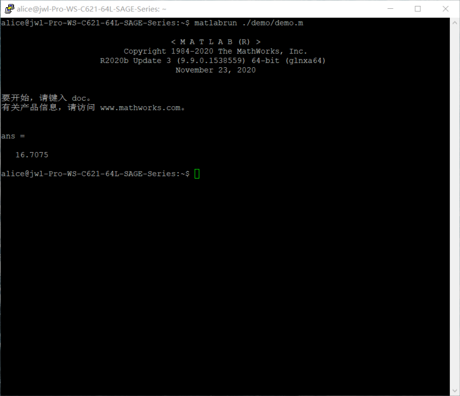

# 服务器使用说明

## 连接到服务器

### SSH

使用ssh可以连接到命令行界面。常用的工具有PuTTy, MobaXterm等。使用cmd或者Powershell等命令行工具也可以连接，但是需要单独安装ssh。以下介绍如何使用PuTTy以及win10自带的PowerShell连接服务器。

1. 使用PuTTY连接

   1. 安装PuTTY：https://www.chiark.greenend.org.uk/~sgtatham/putty/

   2. 打开PuTTY，选中Category最上方的Session并配置服务器信息。内容包括服务器主机名、端口。建议将配置保存在一个特定的名称下。这里我设置的是Group Server。

      

      Saved Sessions中的其它ssh配置是我登录过的其它服务器，不要在意:)

   3. 输入用户名及密码，此处以alice为例

      

      

      即可登录到服务器，效果大致如图所示

      

   

2. 使用PowerShell连接

   1. 安装并启用win10自带的OpenSSH：https://jingyan.baidu.com/article/624e7459f0783274e8ba5aa3.html

   2. 右键开始菜单图标，点击Windows PowerShell

      

   3. 输入命令```ssh alice@222.29.111.107 -p 22```，将alice替换为你的用户名（下同）。然后输入密码

      
      
      登录成功后效果大致如图所示
      
      
      
### SFTP

使用SFTP命令可以连接到服务器的文件系统，方便传输文件。常用的工具有WinSCP, FileZilla等。WinSCP适合用于较小较少文件的日常管理，FileZilla可能更适合少量大文件的传输。

1. 使用WinSCP

   1. 下载WinSCP：https://winscp.net/eng/index.php

   2. 打开WinSCP并配置服务器信息。内容包括协议、主机名、端口、用户名、密码。然后点击登录。

      

   3. 建议：在登录前点击保存，保存用户名及密码，方便日常连接使用

      

   4. 成功连接后的效果

      

      可以通过复制粘贴、拖拽等方式上传下载文件。具体使用方法可以参见官方文档：https://winscp.net/eng/docs/start

2. 使用FileZilla

   1. 安装FileZilla Client：https://filezilla-project.org/

   2. 打开FileZilla并配置服务器信息，内容包括协议+主机名、用户名、密码、端口，并点击快速连接。连接成功后，以后如需再次连接，只需要点击快速连接右侧的向下箭头，就会有连接的历史记录。

      

   3. 成功连接后的效果。FileZilla的使用方法和WinSCP类似。

      

      注：WinSCP及FileZilla连接成功后远程目录内容看似不同，这是因为“.”开头的文件及文件夹在Linux系统下是隐藏的，WinSCP选择不显示而FileZilla选择显示。

## 使用服务器提供的软件

### MATLAB

1. 使用MATLAB交互式模式：

   通过ssh连接到服务器，在终端中输入matlab（小写）并回车，即可进行操作。结束任务后输入exit并回车即可退出交互式环境。

   

2. 使用MATLAB脚本模式：

   通过ssh连接到服务器，在终端中输入```matlabrun path/script.m```，path, script为脚本的路径及名称。

   

   图中"./demo/demo.m"表示在当前目录下有名为demo的子目录，其中有名为demo.m的脚本。
