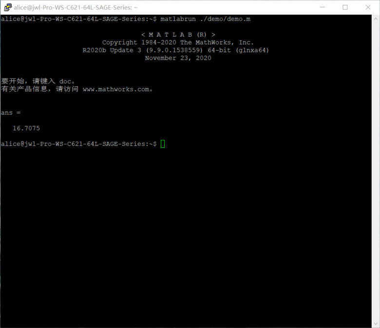

---
title: MATLAB使用说明
layout: page
filename: matlab.md
--- 

# MATLAB

1. 使用MATLAB交互式模式：

   通过ssh连接到服务器，在终端中输入matlab（小写）并回车，即可进行操作。结束任务后输入exit并回车即可退出交互式环境。

   

2. 使用MATLAB脚本模式：

   通过ssh连接到服务器，在终端中输入```matlabrun path/script.m```，path, script为脚本的路径及名称。

   

   图中"./demo/demo.m"表示在当前目录下有名为demo的子目录，其中有名为demo.m的脚本。