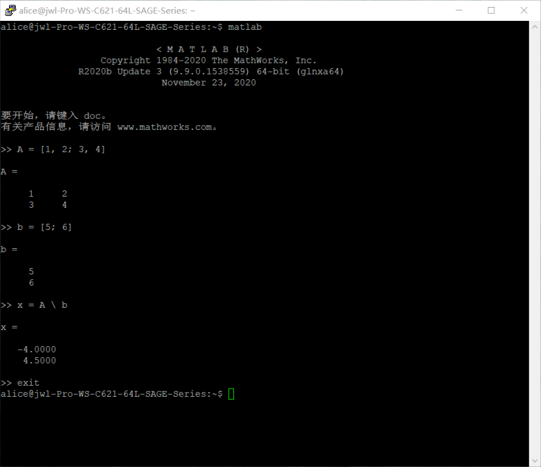

# MATLAB

1. 使用MATLAB交互式模式：

   通过ssh连接到服务器，在终端中输入```matlab```并回车，即可进行操作。结束任务后输入```exit```并回车即可退出交互式环境。

   

2. 使用MATLAB脚本模式：

   通过ssh连接到服务器，在终端中输入```matlabrun path/script.m```，```path```, ```script```为脚本的路径及名称。

   

   图中```./demo/demo.m```表示在当前目录下有名为```demo```的子目录，其中有名为```demo.m```的脚本。
   
3. 使用MATLAB的图形用户界面

   1. 使用[RDP](https://zhangqian-sh.github.io/Group-Server-Tutorial/connect/rdp)连接到服务器，双击桌面上的终端模拟器，输入```matlab-gui```并回车

      

   2. 在打开的MATLAB图形界面中进行编程及计算

      

[返回主页](https://zhangqian-sh.github.io/Group-Server-Tutorial)
