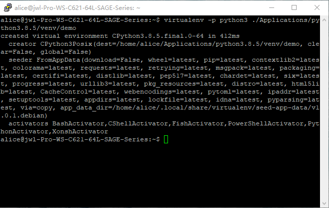
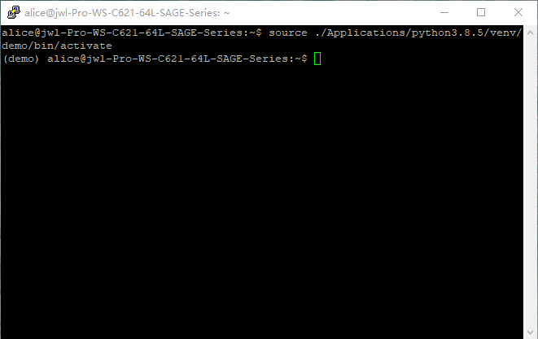
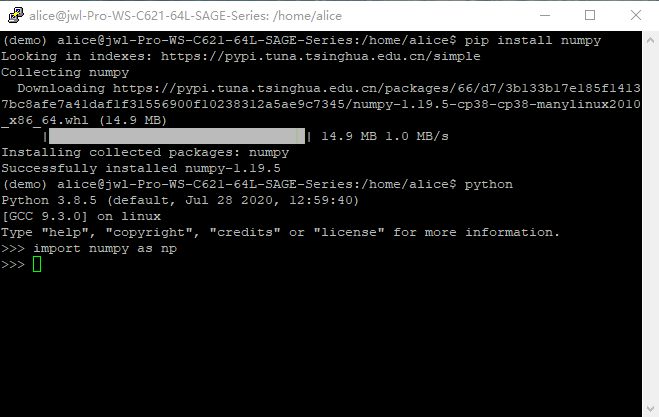
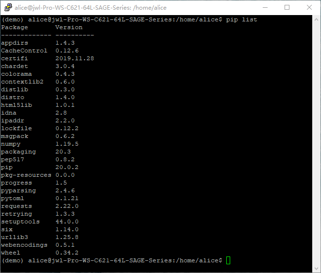

# Python

系统自带了Python 3.8.5。**不要**直接在系统的Python环境下安装包！请按照如下说明**创建虚拟环境并且在虚拟环境中**安装你需要的包并使用。

1. 创建虚拟环境：

   通过ssh连接到服务器，在终端中输入```virtualenv -p python3 env_path```并回车，其中```env_path```为虚拟环境的位置，此处以```./Applications/python3.8.5/venv/demo```为例。最后一级目录名为环境名。成功创建后效果大致如图所示。

   

2. 启动虚拟环境：

   在终端中输入```source env_path/bin/activate```并回车，即可启动虚拟环境。成功启动后效果大致如图所示。

   

3. 在虚拟环境中安装包并使用

   在终端中输入```pip install package_name```并回车，```package_name```为包名，此处以numpy为例。安装完成后即可在python中导入并使用。
   
   

4. 检查安装的包

   在终端中输入```pip list```并回车，可以显示当前虚拟环境下安装的所有包。
   
   

[返回主页](https://zhangqian-sh.github.io/Group-Server-Tutorial)
